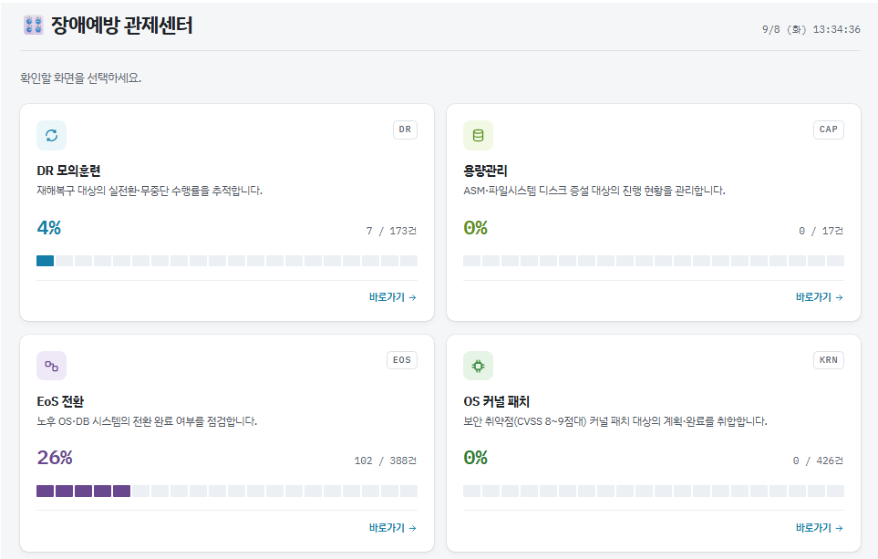
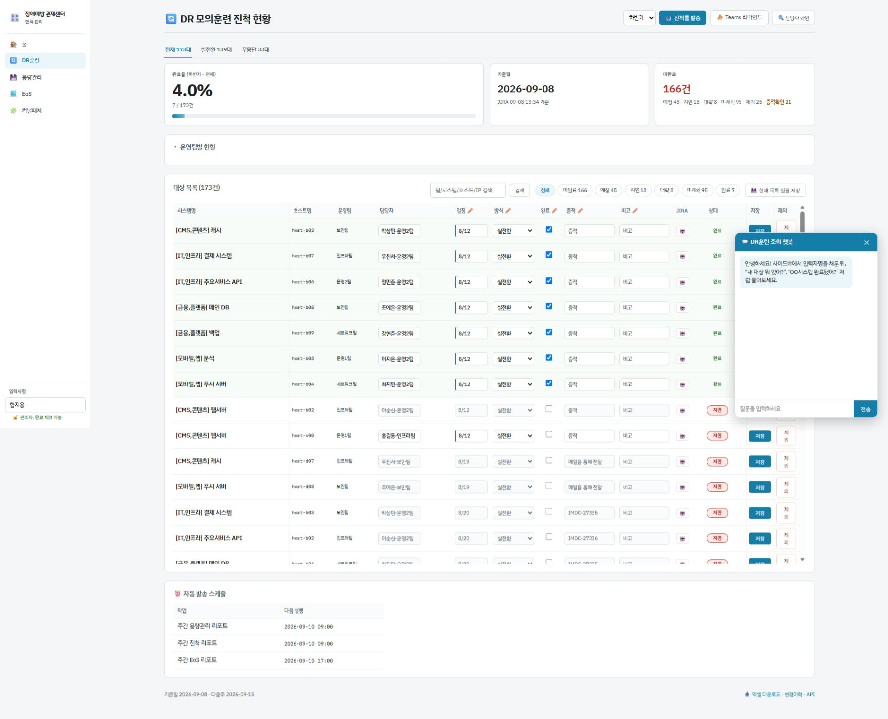
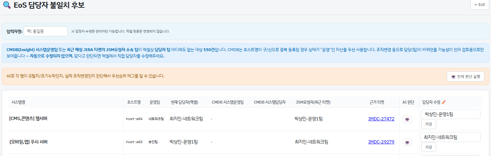
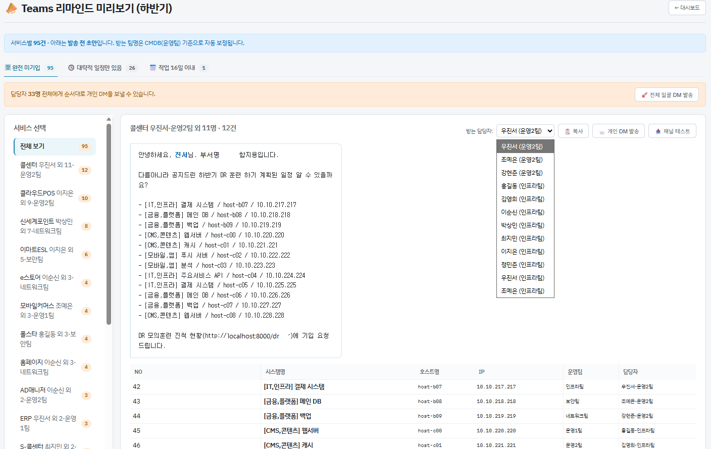

# prevention-tracker

> 인프라 장애예방 활동의 진척을 자동 집계하고, 주간 리포트를 Teams로 발송하는 사내 웹서비스.

엑셀과 JIRA에 흩어져 있던 장애예방 활동 현황을 한 화면으로 모으고, 매주 사람이 손으로 세던 진척률을 자동화했다. 4개 도메인 · 수백 대 규모 서버를 대상으로 실제 운영 중이다.

```
Python 3.12 · FastAPI · Jinja2 · SQLite · APScheduler · Kubernetes
```

<!-- 스크린샷 ①: 포털 홈 또는 도메인 대시보드 전체 (가장 눈에 띄는 자리)
     파일을 docs/screenshots/ 에 넣은 뒤 아래 한 줄의 주석을 풀 것.-->
     


---

## 왜 만들었나

장애예방 활동(DR 모의훈련, 디스크 증설, 노후 OS 전환, 보안 패치)은 **대상 목록은 엑셀에, 실제 수행 근거는 JIRA 티켓에** 있었다. 매주 진척을 보고하려면 담당자가 두 자료를 눈으로 대조해야 했고, 그 과정에서 세 가지 문제가 반복됐다.

- **집계가 사람마다 달랐다.** "계획일이 지났으니 됐겠지"로 세면 실제 수행치보다 크게 부풀려진다.
- **대조가 오래 걸렸다.** 티켓 제목·본문에 적힌 호스트명/IP를 수백 건 눈으로 맞춰야 했다.
- **근거가 남지 않았다.** 왜 완료로 쳤는지, 왜 대상에서 뺐는지가 보고서에만 있고 데이터에는 없었다.

이 서비스는 세 문제를 각각 **판정 규칙의 코드화 / 자동 매칭 / 근거와 이력의 영속화**로 풀었다.

---

## 관리 대상

| 도메인 | 내용 | 완료의 근거 |
|---|---|---|
| **DR훈련** | DR 모의훈련 (실전환 / 무중단) | 해당 반기 JIRA 티켓 |
| **용량관리** | 임계치 초과 디스크 증설 (DATA / ARCH) | 증설 완료 티켓·표기 |
| **EoS** | 노후 OS/DB 전환 | CMDB 자산명 `_OLD` 전환 ∪ JIRA 티켓 |
| **커널패치** | 보안 취약점(CVSS 8~9점대) 커널 패치 | 관리자 확인 (자동 판정 준비 중) |

---

## 화면

<!-- -->┌─ 스크린샷 자리 ─────────────────────────────────────────────────┐
<!-- docs/screenshots/ 에 아래 이름으로 넣고, 해당 줄의 주석만 풀면 된다.
     마스킹 기준은 docs/screenshots/README.md 참고.-->


> 표에서 바로 편집 · 상태별 필터 · 변경이력 자동 기록


> 엑셀 담당자와 CMDB 등록 담당자 대조, 오탈자/조직변경 AI 분류


> 발송 전 팀별 초안 확인 후 Teams DM

     └──────────────────────────────────────────────────────────────┘ 

---

## 아키텍처

```
   ┌─ 엑셀 (반기 대상 목록, 원본)
   ├─ JIRA REST        (변경 티켓)
   ├─ JIRA Insight     (CMDB 자산·담당자)      ┌──────────────┐
   ├─ Confluence REST  (주간 작업계획 PDF)  ──→ │ 매칭 · 판정   │──→ 대시보드
   └─ Polestar (EMS)   (CI 상태)              └──────┬───────┘     주간 Teams 리포트
                                                     │              담당자 DM
                              SQLite ────────────────┘
                     (웹 입력값 · 변경이력 · 관측기록 · 발송 스냅샷)
```

**엑셀은 읽기 전용 원본이고, 사람이 웹에서 고친 값은 SQLite에 쌓여 엑셀보다 우선한다.** 원본을 건드리지 않으므로 엑셀이 교체돼도 웹 입력이 살아남고, 파일 수정시각이 바뀌면 자동으로 다시 읽는다.

```
app/
├── core/       외부 연동 클라이언트 · 엑셀 로더 · 스케줄러   (13)
├── services/   판정 · 매칭 · 리포트 · 캐시 · 챗봇            (28)
├── models/     SQLite 스키마와 접근                          (3)
└── web/        FastAPI 라우트 + Jinja2 템플릿      (7 + 15)
```

Python 약 9,500줄 · 템플릿 약 4,500줄 · 엔드포인트 63개.

---

## 설계에서 다뤄야 했던 것들

### 1. "완료"의 정의가 도메인마다 다르다

가장 많은 시간을 쓴 부분이다. 네 도메인이 각자 다른 근거를 쓰기 때문에 판정을 하나로 합칠 수 없었고, 대신 **판정 함수를 도메인별로 분리하고 상태 표기(완료/예정/지연/대략/미계획)와 정렬 규칙만 공유**했다. 화면을 오가는 사람이 도메인마다 다른 규칙을 외우지 않아도 되게 하려는 의도다.

일관되게 지킨 원칙이 하나 있다 — **계획일 경과를 완료로 보지 않는다.** 초기 구현에는 "일정이 지나면 완료" fallback이 있었는데, 실제 수행치보다 부풀려져 제거했다.

EoS는 근거가 둘의 합집합이다.

- JIRA `작업 완료(CMDB)` 필드에 `_OLD`로 끝나는 자산이 달린 티켓 (Insight Key로 정확 매칭)
- Polestar에서 CI 이름이 `_OLD`로 바뀐 대상 (전환 완료 시 AS-IS 자산명에 붙는 규칙)

반려·중단·종료 상태의 티켓은 근거에서 제외한다.

### 2. 사라지는 근거 — 관측 래치

EoS 전환이 끝난 AS-IS 서버는 한동안 `_OLD`로 남아 있다가 **결국 폐기되어 CMDB에서 사라진다.** 판정은 매번 "지금 상태"를 다시 보기 때문에, CI가 지워지는 순간 완료 근거도 같이 사라져 **완료 대수가 뒤로 가는** 문제가 있었다.

판정 결과가 아니라 **관측 사실을 날짜와 함께 적재**해서 풀었다.

```python
# eos_polestar_seen(item_no, reason, first_seen, last_seen)
"present": True if current is None else (item_no in current)
```

조회 자체가 실패했을 때(`current is None`)와 조회는 됐는데 대상이 없을 때를 구분한다. 전자를 폐기로 오인하면 외부 시스템이 잠깐 죽을 때마다 완료율이 출렁인다. 오탐이었다면 관리자가 관측 기록을 지울 수 있고, 다음 조회에서 다시 보이면 재기록된다.

같은 패턴을 DR 제외 처리에도 적용했다. 제외 확정된 대상의 완료 인정일은 **반기 종료일과 제외 처리일 중 늦은 쪽**이다 — 반기 도중에는 아직 미완료로 남겨야 하고, 반기가 끝난 뒤 새로 제외한 건을 소급하면 이미 나간 결산 숫자와 어긋난다.

### 3. 외부 시스템이 느리다 — SWR + 병렬화

대시보드 한 번 여는 데 JIRA 수백 건 조회 + CMDB 대조 + Polestar 조회가 필요해 **첫 화면까지 15초 이상** 걸렸다.

**stale-while-revalidate + single-flight**로 바꿨다. TTL이 지나도 일단 있는 값을 즉시 돌려주고 갱신은 뒤에서 돌린다. 같은 키에 대한 동시 갱신은 락으로 한 번만 실행되어, 캐시가 비는 순간 요청이 몰려도 외부 호출이 중복되지 않는다. 서버 기동 시 미리 채워두므로(prewarm) 사용자가 cold를 만나는 경우는 사실상 없다.

```
EoS 대시보드    cold 15.27s  →  warm 0.035s
```

JIRA 조회 자체도 **첫 페이지로 전체 건수를 받은 뒤 나머지 오프셋을 병렬 요청**하도록 바꿔 15.4s → 2.8s가 됐다. 최적화 전후로 **티켓 집합과 필드가 동일한지 확인한 뒤** 반영했다.

> 이 과정에서 한 번 실패했다. 매칭 로직을 "코퍼스 스캔" 방식으로 바꿨더니 오히려 느려져서(8.76s → 10.67s) 되돌리고, 공백 토큰 색인 방식으로 다시 짰다. 결과가 바이트 단위로 동일한지 도메인별로 검증한 뒤 채택했다.

### 4. 티켓과 대상을 잇기

티켓 본문에 적히는 식별자가 제각각이라 **IP / 호스트명 / CMDB Insight Key** 세 가지를 쓴다. EoS는 Key 매칭을 우선하고 그 필드가 없는 티켓만 IP·호스트명으로 보강한다.

매칭이 안 된 건에 대해서는 "왜 안 됐는지"를 AI로 진단하는 버튼을 뒀다. 사람이 티켓을 열어보지 않고도 오탈자인지, 티켓이 실제로 없는지 판단할 수 있다.

### 5. 잘못된 숫자가 나가지 않게

리포트는 정기 발송이라 한 번 나가면 되돌릴 수 없다. 발송 직전 **지난 발송분(`report_snapshot`)과 비교해 이상 징후를 규칙으로 감지**한다 — 완료 대수 감소, 진행률 급변, 전체 대상 변동. 감지는 코드가 하고 **해석만** AI가 맡는다.

이상이 있어도 발송을 막지는 않는다. 정기 보고를 거르는 쪽이 더 큰 문제라, 경고를 로그와 화면에 남기고 보낸다.

---

## 주간 리포트

목요일 자동 발송 (`.env`로 조정).

| 리포트 | 시각 | 비고 |
|---|---|---|
| DR훈련 · 용량관리 | 09:00 | |
| EoS | 17:00 | 담당자가 목요일 중 주간계획을 작성하므로 그 이후 |

Teams 워크플로가 개행을 렌더링하지 않아, 평문과 함께 `<br>`로 변환한 HTML 본문을 같이 실어 보낸다.

---

## AI를 쓴 방식과 쓰지 않은 곳

**계산·판정은 전부 코드가 한다.** AI는 서술과 해석만 맡는다. 목록을 자유 생성시키지 않고 **후보를 주고 고르게** 해서 없는 시스템을 지어내는 것을 막았다.

| 용도 | 성격 |
|---|---|
| 주간 특이사항 요약 | 서술 |
| 매칭 실패 원인 진단 | 해석 |
| 리포트 이상 징후 해석 | 해석 |
| 담당자 불일치 판단 (오탈자 / 조직변경) | 분류 |
| 진척 조회 챗봇 (도메인별) | 조회 |

에이전트 키가 없으면 **해당 기능만 조용히 생략되고 나머지는 정상 동작한다.**

---

## 그 밖의 기능

- **인라인 편집** — 일정·완료·증적·비고·담당자를 표에서 바로 수정, 변경이력 자동 기록
- **권한 분리** — 입력자명이 관리자 목록에 있을 때만 완료 체크·제외 처리·수동 발송 노출
- **제외 처리** — 수행하지 않기로 확정된 대상을 사유와 함께 분리, 복귀 가능
- **미계획 리마인드** — 일정 미등록 담당자에게 Teams DM (미리보기 후 발송)
- **담당자 확인** — 엑셀 담당자와 CMDB 등록 담당자 대조
- **엑셀 내보내기 / 조회 API** — 도메인별 제공

---

## 실행

```bash
cp .env.example .env      # 각 값 채우기
pip install -r requirements.txt
uvicorn app.main:app --reload
```

`.env`는 gitignore 대상이며 인증정보·에이전트 키가 모두 여기 들어간다. Kubernetes 배포 시 **Secret과 코드를 반드시 함께 갱신해야 한다** — 한쪽만 배포되면 설정 로딩에서 실패하거나, 더 나쁘게는 필드 ID가 비어 조용히 잘못된 숫자가 나간다.

---

## 알려진 한계

- **커널패치 자동 판정 미완.** 패치 레벨이 EMS REST API에 노출되지 않는다(인터페이스 정의서 108개 엔드포인트 전수 확인). 화면의 PQL 검색은 거르기만 되고 값을 돌려주지 않으며, 배포판마다 타겟 커널이 달라 단일 패턴으로는 판정할 수 없다. 현재는 관리자 확인으로 집계하고, 근거 파일 경로만 채우면 자동 판정이 붙도록 판정부를 분리해 두었다.
- **엑셀이 계약이다.** 컬럼명이 바뀌면 로더를 고쳐야 한다. 머리글은 별칭 집합으로 찾아 어느 정도 흡수하지만 완전하지 않다.
- **자동화 테스트가 없다.** 판정·매칭 변경 시 이전 결과와 대조하는 검증 스크립트를 매번 작성해 돌리는 방식으로 대신하고 있다.
